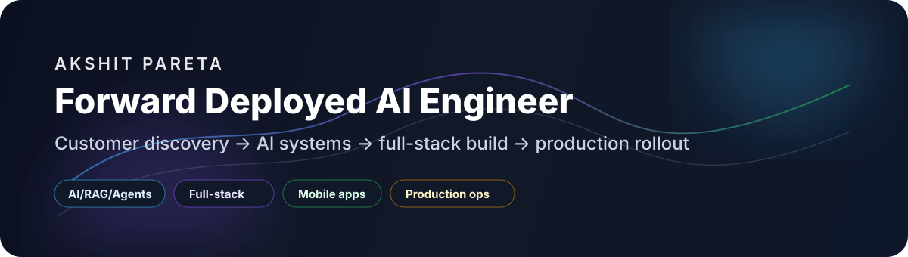

<p align="center">
  
</p>

<p align="center">
  <a href="https://akshitpareta.com"></a>
  <a href="https://www.linkedin.com/in/akshit-pareta-ai"></a>
  <a href="mailto:akshitpareta101@gmail.com"></a>
  <a href="https://github.com/Akshit1018"></a>
</p>

<p align="center">
  <b>Jaipur, Rajasthan, India</b> · <a href="tel:+919680810188">+91 96808 10188</a>
</p>

---

## I build business software that reaches production

I work at the intersection of **customer discovery, AI engineering, full-stack product build, and rollout**. My strongest lane is Forward Deployed Engineering: understand the business workflow, define the smallest valuable release, build across web/mobile/backend/AI, deploy it, and keep improving it from real user feedback.

<table>
<tr>
<td width="25%" valign="top"><b>Forward Deployed AI</b><br/>Discovery, workflow mapping, solution design, implementation, rollout, user feedback.</td>
<td width="25%" valign="top"><b>AI + Automation</b><br/>RAG workflows, agent routing, document automation, WhatsApp/email flows, operational copilots.</td>
<td width="25%" valign="top"><b>Full-stack + Mobile</b><br/>React, Next.js, FastAPI, Laravel, WordPress, Shopify, Flutter, Firebase, SQL, APIs.</td>
<td width="25%" valign="top"><b>Production Ops</b><br/>Linux, Docker, Nginx, VPS/KVM, AWS/GCP paths, app-store release checks, cost-aware deployment.</td>
</tr>
</table>

---

## Public work

<table>
<tr>
<td width="50%" valign="top">

### [OpenSalesAI](https://github.com/Akshit1018/OpenSalesAI)
Multi-agent sales-intelligence workspace with supervisor routing, specialist agents, RAG-style knowledge flow, and GTM workflow thinking.

`LangGraph` `RAG` `FastAPI` `TypeScript` `Sales AI`

</td>
<td width="50%" valign="top">

### [Agent-harness-system](https://github.com/Akshit1018/Agent-harness-system)
Agent orchestration harness for structured multi-agent execution: orchestrator/worker topology, context budgeting, iteration limits, and dependency-cycle detection.

`Agents` `Orchestration` `Shell` `Automation`

</td>
</tr>
<tr>
<td width="50%" valign="top">

### [my-n8n-project](https://github.com/Akshit1018/my-n8n-project)
Reusable automation workflow library spanning RAG, sales, content, email, recruiting, documents, voice AI, research, security, and ecommerce operations.

`n8n` `Automation` `Workflows` `AI Ops`

</td>
<td width="50%" valign="top">

### [uttar-sewa](https://github.com/Akshit1018/uttar-sewa)
AI service-platform concept for intake, service diagnosis, provider matching, and structured service request workflows.

`FastAPI` `JavaScript` `AI Intake` `Matching`

</td>
</tr>
<tr>
<td width="50%" valign="top">

### [stockkup](https://github.com/Akshit1018/stockkup)
TypeScript product workspace for market-facing workflows, useful as a product-engineering and full-stack reference.

`TypeScript` `Product` `Market workflows`

</td>
<td width="50%" valign="top">

### [gemini-skill](https://github.com/Akshit1018/gemini-skill)
Python workflow/skill repository for structured AI-assisted execution, repeatable prompts, and agent operating patterns.

`Python` `Agent workflows` `Skills`

</td>
</tr>
</table>

---

## Private/client delivery patterns

These are representative patterns from client and Gosotek delivery work; live/private project links are intentionally not exposed here.

- **ERP/CRM/HRM-style systems:** sales workflows, field-force tracking, task allocation, stock/accounting modules, dashboards, and admin panels.
- **Commerce and business apps:** WordPress, Shopify, Laravel/PHP backends, React/Next.js frontends, Flutter apps, and API/database architecture.
- **AI workflow products:** document search, RAG-style retrieval, operational assistants, WhatsApp/email automation, human review loops, and internal copilots.
- **Mobile releases:** Flutter/iOS/Android app flows, Firebase integrations, store-readiness checks, release QA, and production-support loops.
- **Founder-office execution:** discovery, prioritization, PRDs, MVP scope, delivery planning, QA loops, rollout support, and cost-conscious infrastructure choices.

---

## Stack

<p align="center">
  
</p>

| Lane | Tools and work |
|---|---|
| **AI / Agents** | RAG, LangGraph-style orchestration, retrieval workflows, citation grounding, human-in-the-loop review, document automation |
| **Product engineering** | Discovery, user journeys, PRDs, workflow mapping, acceptance criteria, MVP-to-production iteration |
| **Web / Backend** | React, Next.js, TypeScript, JavaScript, Python, FastAPI, Node.js, Laravel, PHP, WordPress, Shopify, REST APIs |
| **Mobile / Cloud** | Flutter, Dart, Firebase, SQL, Linux, Docker, Nginx, VPS/KVM, AWS/GCP deployment paths |

---

## Role fit

```text
Forward Deployed Engineer / Forward Deployed AI Engineer
Applied AI Engineer / AI Full-Stack Engineer
Solutions Engineer / Solutions Architect for AI products
Technical Product Manager for AI, automation, and internal tools
```

---

## GitHub signal

<p align="center">
  
  
</p>

<p align="center">
  
</p>

---

## Contact

<p align="center">
  <b>Open to FDE, Applied AI, AI Full-Stack, Solutions Engineering, and Technical Product roles.</b><br/>
  <a href="mailto:akshitpareta101@gmail.com">akshitpareta101@gmail.com</a> · <a href="https://akshitpareta.com">akshitpareta.com</a> · <a href="https://www.linkedin.com/in/akshit-pareta-ai">LinkedIn</a>
</p>
